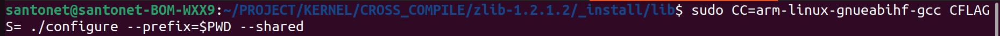
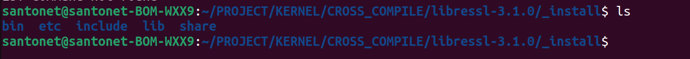
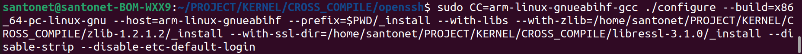
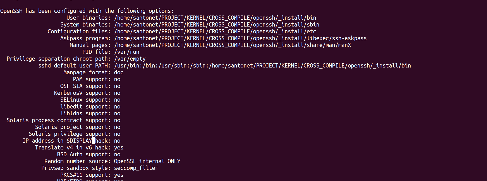
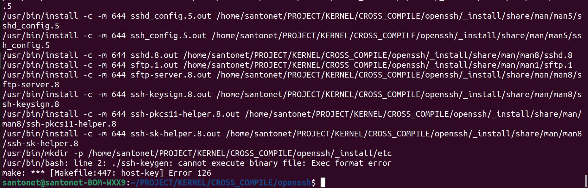
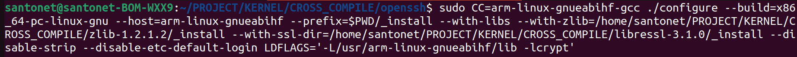

Для начала нужно было установить zlib и libressl:
Код для конфигурации zlib
- 
Код для конфигурации libressl записать забыл, но добавлю скрин получившегося каталога
- 

Далее собираю конфиг openssh.
- 
config собрался 
- 

Далее
- make
- make install 
Но после ввода команды make install однако еще выходили ошибки, так что до конечной сборки еще не дошло. 
- 

На сайте находил похожую ошибку
https://stackoverflow.com/questions/45274853/error-cross-compiling-openssh-embedded-linux

Но добавление флага LDFLAGS вызвало ошибку еще в конфиге
- 

Поэтому проблема пока еще открыта

